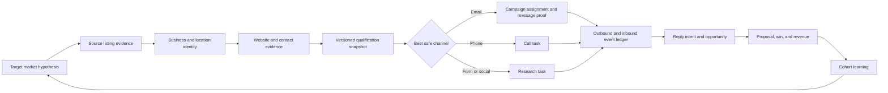

# Axiom Revenue Engine rebuild blueprint

Status: execution plan, grounded in the production D1 snapshot from 2026-08-16.

Historical baseline, not current setup instructions: Riley's 2026-09-08 correction
excludes Google Workspace. Any Workspace recovery/renewal requirement below is
superseded by `MASTER_PLAN.md` and `OWNER_CONTEXT.md`; preserve historical incident
facts without treating them as permission to buy or reconnect Workspace.

## The new narrative

> Axiom is an evidence-to-revenue operating system for finding local-service businesses with provable website conversion gaps, reaching the right operator with a truthful and useful observation, and learning from every outcome until those conversations become customers.

Axiom is not a bulk scraper and it is not an email cannon. Scraping is one acquisition input. Email is one delivery channel. The product's job is to create qualified conversations for Axiom's website services, show why each business is worth contacting, keep evidence for every claim, and make the next campaign better than the last one.

The operator should be able to answer five questions from one screen:

1. Are the system and mailboxes safe?
2. Which businesses have a real website or conversion problem Axiom can solve?
3. Do we have a verified route to the right person?
4. Which message and offer are producing positive replies and opportunities?
5. Which source, niche, geography, and campaign are creating revenue?

## What production says today

The production snapshot establishes the baseline, not a forecast:

| Signal | Current value | Meaning |
| --- | ---: | --- |
| Leads stored | 10,480 | Large inventory, but much of it is not decision-ready |
| Active leads | 1,888 | 18.0% of stored leads remain active |
| Active leads with an email | 1,761 | High apparent coverage; provenance and mailbox verification are not durable |
| Active leads with a named contact | 425 | Only 22.5% have a person attached |
| Emails marked sent | 1,936 | Delivery denominator |
| Confirmed reply evidence | 4 | 0.207% raw replies per sent email |
| Active opportunities | 1 | Almost no downstream movement |
| Won/active clients | 1 | One historical win is attributable, but the sample is too small to optimize from |
| Scrape jobs | 3,590 | Large number of synchronous attempts |
| Failed scrape jobs | 872 | 24.3% failed |
| Stopped sequences | 2,747 / 3,275 | 83.9% are stopped |

Automation is intentionally stopped. On 2026-06-03, Aidan enabled the global, emergency, and intake pauses with the reason `Google Workspace not renewed - full stop (Claude Code)`. Cron is still healthy and is recording skipped runs. Sending must remain stopped until Workspace and mailbox health are explicitly reverified.

The biggest data-quality defect is geographic: the old engine searched every target as `<niche> in <city>, Ontario`, even when the target was Vancouver, Seattle, Dallas, or another non-Ontario location. The first implementation slice fixes this end to end.

The first v2 qualification backfill separates account value from contact route. It identifies 1,836 active `OUTREACH`/`PRIORITY` accounts: 861 with an email route and 975 that should be worked through phone, form, or social instead of being hidden by an email-only score cap. Historical snapshots are explicitly marked as migrated evidence; newly discovered accounts use the live v2 policy.

## North-star and guardrail metrics

The north-star metric is **qualified positive replies per 100 verified first touches**. This is closer to revenue than open rate and is harder to inflate than total replies.

The paired business metric is **qualified opportunities per 100 verified contacts**, with proposal value and won revenue attached to the same acquisition cohort.

Every report must use explicit definitions:

- Verified first touch: one accepted first email to a contact that passed address, suppression, and policy checks.
- Reply: an inbound response tied to the outbound Gmail thread.
- Positive reply: a human reply classified as interested, referral to the decision-maker, question, or meeting intent.
- Opportunity: a human-confirmed business conversation moved into the CRM pipeline.
- Win: signed, active, delivered, or retained work with recorded value.

Safety and quality guardrails:

- Hard bounce rate below 2%.
- Complaint rate below 0.1%.
- Unsubscribe/negative-intent rate below 1% while offers are being tested.
- 100% of generated claims linked to stored evidence.
- 100% of sends linked to a policy version, message version, source, and cohort.
- No autonomous scaling when positive-reply classification, bounce sync, or mailbox health is stale.
- No variant scales past 25 verified sends without a review; no loser scales past 100.

Reasonable improvement targets, not guarantees:

- First 30 days after a controlled restart: at least 1 qualified positive reply per 100 verified first touches and less than 2% hard bounces.
- By 90 days: 2-3 qualified positive replies per 100 verified first touches in the best niche/offer cells.
- At least 20% of positive replies become qualified opportunities.
- Every opportunity and win is attributable to source, segment, evidence, offer, and message variant.

## The target operating model

### 1. Source and identity layer

Store raw evidence before turning it into a lead:

- `SourceRun`: provider, target, query, geography, start/end status, cost, and quality.
- `SourceListing`: immutable provider payload, provider listing ID, observed name, URL, phone, address, coordinates, and capture time.
- `Business`: canonical company identity.
- `BusinessLocation`: one row per physical service location.
- `BusinessSourceIdentity`: durable mapping between provider IDs and canonical businesses.

Entity resolution should be explainable. Exact provider ID and exact normalized domain are high confidence. Exact phone plus compatible location is high confidence. Fuzzy name/address matches require review. Never silently merge two branches because they share a switchboard number.

### 2. Evidence and contact layer

- `WebsiteSnapshot`: page URLs, capture timestamps, status codes, performance/mobile signals, conversion elements, screenshots or hashes, and extracted facts.
- `EvidenceClaim`: claim type, human-readable observation, source URL, captured fragment/hash, confidence, observed time, and expiry.
- `ContactCandidate`: address/phone/profile, source URL, role, person name, relationship to business, discovery method, verification state, and last verification time.

Contact verification states should be explicit: `DISCOVERED`, `FORMAT_VALID`, `MX_VALID`, `DOMAIN_MATCH`, `DELIVERABLE`, `BOUNCED`, `SUPPRESSED`, and `STALE`. MX presence is not the same thing as recipient deliverability. A generic inbox is not the same thing as a named operator.

### 3. Qualification layer

Replace one overloaded score with four independent, versioned dimensions:

| Dimension | Weight | What it answers |
| --- | ---: | --- |
| Website need | 0-40 | Is there a specific conversion problem Axiom can truthfully solve? |
| Business fit/value | 0-25 | Is the likely job value and business model a fit for Axiom's services? |
| Reachability | 0-20 | Can Axiom reach a decision-maker through a verified channel? |
| Timing/intent | 0-15 | Is there a timely trigger or signal that makes outreach relevant now? |

Hard gates stay separate from the score: suppression, prior contact cooldown, government/directories, franchise policy, invalid contact, legal/compliance restrictions, and active-customer status.

Route bands:

- `RESEARCH`: insufficient evidence or unresolved identity.
- `REVIEW`: credible fit, but a person or evidence claim needs human confirmation.
- `OUTREACH`: evidence and at least one safe channel are ready.
- `PRIORITY`: high-value fit, strong evidence, and a decision-maker route.

Missing email must not cap business potential. It should change the route to phone, form, social, or research. Qualification decides whether the account matters; channel readiness decides how to contact it.

Initial segment focus should favor local-service categories where a small improvement can pay for a website project: roofing, HVAC, plumbing, electrical, restoration, higher-value renovation, and similar urgent/high-ticket services. Each niche/geography pair remains a hypothesis until its positive-reply and opportunity data justify more volume.

### 4. Message and offer layer

Every first touch needs a proof chain:

1. One observable fact about the business or its site.
2. One reasonable business consequence, phrased as a possibility rather than a fabricated certainty.
3. One small, credible action Axiom can take.
4. One low-friction question.

Do not claim a lost-lead count, revenue result, broken behavior, completed mockup, or delivery timeline unless the evidence exists. Generated text must store the evidence IDs it used. If no strong claim exists, do not generate a personalized email.

Recommended offer ladder:

- First touch: one useful observation plus permission to send a short three-point teardown.
- Positive reply: send the actual teardown or a short recorded review.
- Discovery: quantify the current lead path, missed calls/forms, and highest-value service.
- Proposal: connect scope and price to the business's real conversion path, not generic design language.

Experiment cells must bind `segment + evidence type + offer + message variant + mailbox`. Randomize within a cell. Compare positive replies and opportunities, not opens. Store the exact prompt, model, output, policy version, and human edits.

### 5. Outreach and reply layer

Use staged, resumable jobs instead of one long scrape invocation:

1. Discover listings.
2. Resolve business identity.
3. Capture website evidence.
4. Discover and verify contacts.
5. Produce a qualification snapshot.
6. Assign an eligible campaign/variant.
7. Generate and validate the message.
8. Send with an idempotent delivery record.
9. Ingest the full inbound message.
10. Classify intent and create the right CRM task.

Store `Campaign`, `Variant`, `Assignment`, `GeneratedMessage`, `OutboundEvent`, `InboundMessage`, `ReplyClassification`, and `Suppression` separately. Reply matching should use Gmail thread/message headers first, normalized participant identity second, and manual review for ambiguity. Exact sender-string matching alone is not sufficient.

Positive replies should immediately stop the sequence and create an owner-visible task. Negative replies suppress future outreach. Referrals create a new contact candidate without losing the original relationship. Out-of-office replies pause and reschedule rather than counting as positive.

### 6. CRM and learning layer

Lead discovery and CRM opportunity are different lifecycle concepts. A CRM opportunity begins only when there is real human intent or an operator promotes the account.

Use an append-only `FunnelEvent` ledger for `SCRAPE_JOB_CREATED`, `LEAD_DISCOVERED`, `OUTREACH_SENT`, `OUTREACH_FAILED`, `BOUNCE_DETECTED`, `REPLY_DETECTED`, `OPPORTUNITY_CREATED`, `DEAL_WON`, and `DEAL_LOST`. Mutable tables remain convenient projections; the ledger is the measurement record.

Dashboards must cohort by first-touch date and break down results by:

- source and scrape target;
- niche, city, region, and country;
- website-need evidence type;
- contact source and verification state;
- mailbox;
- campaign and message variant;
- reply intent;
- opportunity stage and value.

## Release sequence

### Phase 0 — safety and truth (now)

- Keep the existing emergency stop until Google Workspace and both mailboxes are verified.
- Fix geography propagation and remove the Ontario hardcode.
- Preserve scrape target/job provenance on new leads.
- Introduce the append-only funnel event ledger and backfill reliable historic milestones.
- Store a versioned four-part qualification snapshot and route strong no-email accounts to alternate channels.
- Move the dashboard funnel to deduplicated evidence events.
- Publish this blueprint beside the code.

Exit gate: all tests/build pass, migration succeeds, live app is healthy, and automation is still stopped.

### Phase 1 — evidence-first acquisition

- Introduce `SourceRun`, `SourceListing`, `Business`, `BusinessLocation`, and source identities.
- Break discovery, website capture, contact resolution, and scoring into separate retryable jobs.
- Store website snapshots and contact candidates with provenance.
- Replace the current blacklist growth pattern with structural listing validation and typed rejection reasons.
- Add revalidation/expiry policies for website and contact facts.

Exit gate: at least 95% of accepted leads have source provenance; scraper failure below 5%; no location mismatch in a sampled 100-run audit.

### Phase 2 — qualification and channel routing

- Ship the four-dimensional qualification model and a single policy module used by intake, queue, generation, and send-time validation.
- Store immutable qualification snapshots and reason codes.
- Add phone/form/social research queues for good accounts without verified email.
- Add a 25-account human calibration set per priority niche before autonomy.

Exit gate: intake, dashboard, queue, and send agree on the same policy version; operator review precision above 80% for `OUTREACH`/`PRIORITY` accounts.

### Phase 3 — campaigns and truthful personalization

- Implement campaigns, variants, assignment, evidence-bound generation, and message validation.
- Use a narrow first-touch offer and compare it with a teardown offer.
- Store generated claims and reject unsupported statements before send.
- Fix pending-mailbox accounting and generate close to send time.

The first Phase 3 slice is now implemented as `evidence-first-v1`: every new generated step receives a deterministic campaign/variant assignment, an evidence envelope, the selected observation, CTA type, confidence, and validation state. Unsupported outcome, competitor, visitor-behaviour, and timeline claims are rejected; generic enrichment alone cannot authorize an email; unsafe legacy cached copy is regenerated; and the duplicate pending-mailbox increment is removed. The dashboard's Message Learning Lab reports first-touch replies only for these explicitly attributed sends and leaves historical mail unassigned rather than guessing.

Exit gate: every sent message has evidence IDs and variant attribution; no unsupported-claim defects in a 100-message audit.

### Phase 4 — reply intelligence and CRM execution

- Persist inbound bodies/headers safely and classify positive, negative, referral, question, out-of-office, bounce, and ambiguous replies.
- Add task ownership and response-time alerts.
- Make opportunity creation explicit and connect proposals/wins to acquisition cohorts.

Exit gate: at least 95% of replies auto-linked correctly; every positive reply has an owner/task within five minutes.

### Phase 5 — controlled restart and learning loop

Restart only after the Workspace/mailbox gate passes:

1. Confirm Workspace billing and both OAuth connections.
2. Confirm SPF, DKIM, DMARC, mailbox send/receive, and bounce/reply sync.
3. Run a five-address internal seed test.
4. Run 10 verified first touches per mailbox per day for three business days.
5. Review every message, bounce, and reply.
6. Increase gradually only when guardrails remain healthy.

Allocate new volume with an exploration floor: 80% to proven cells and 20% to controlled tests. Pause a cell automatically when bounce/complaint thresholds fail or evidence quality drops. Promote variants on qualified positive replies and opportunities, never on opens alone.

## Definition of done

The rebuild is complete when:

- a new business can be traced back to its exact source query and raw evidence;
- every qualification decision is reproducible from a versioned snapshot;
- every outbound claim has evidence and every delivery is idempotent;
- every inbound reply is stored, classified, and attached to a CRM action;
- every opportunity and win is attributable to a cohort and value;
- scraper failures are below 5% and location correctness passes audit;
- the operator can stop any stage independently;
- the system improves allocation based on qualified replies, opportunities, and revenue;
- the production deployment path is owned by an active Cloudflare member and works automatically from `main`.

The target is not more scraped rows or more email volume. The target is a smaller, more trustworthy set of accounts, better reasons to contact them, safer delivery, faster human follow-up, and measurable customer creation.
