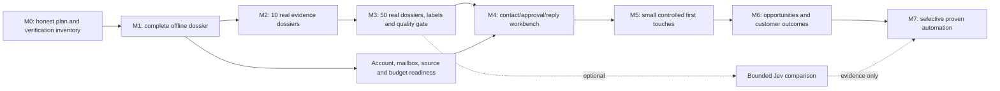

# Revenue Engine delivery plan

**Version:** v2, 2026-09-20. **Authority:** implementation roadmap accompanying [MASTER_PLAN](MASTER_PLAN.md); no work below is authorized to execute by this documentation commit. Runtime policies and current approval contracts remain unchanged. A milestone is complete only when its observable exit gate is evidenced, not when its files exist.

## Critical path and parallel work

Design and sink-test CRM/reply handling during M4; M6 proves it with real outcomes after M5. The engine must not send first and build reply handling later. Source/vendor terms and non-secret account inventory can be prepared in parallel; activation is a distinct decision. An unavailable Jev/OpenAI account must not block M1–M4's deterministic/manual paths.

## Working method

One integration owner owns shared interfaces and final verification. Delegate independent audits or non-overlapping work; do not have multiple agents edit the same policy or migration. Use a fresh bounded context, exact task outputs, and task-specific tests. Reuse prepared research instead of asking multiple agents to research the same provider.

Before implementation, inspect HEAD, `git status`, current source, and relevant ADRs. Two untracked `private-kw-assessment-progress` files predate this revision; review their ownership/diff before integrating or replacing them. They are not silently adopted by this docs-only commit.

Every milestone has a scope, proof, owner outcome and rollback. Produce a working vertical slice rather than splitting each harmless internal operation into another disconnected milestone. Preserve existing trust/approval contracts; if composition needs a simpler operational approval, propose one bounded reviewed invocation and test it instead of bypassing the current rules.

## M0 — Save a truthful baseline

**Deliverable:** this master plan, companions, capability inventory, source research, preserved historical documents, and a local Git checkpoint. No account, provider, deployment, source collection, inbox operation, migration, runtime configuration or application implementation changes.

**Exit:** documentation links and policy consistency checked; required repository verification attempted and results recorded honestly. The 2026-09-20 baseline has a clock-dependent tracked fixture failure described in STATUS. A documentation checkpoint may preserve that known failure; it is not a green implementation/release checkpoint.

## M1 — Complete one offline business-to-dossier flow

**Owner outcome:** one understandable dossier built through the real current writers/readers, reproducible after process restart, with a precise reason if evidence is incomplete. Use synthetic data or an already separately approved local import; no new website/provider contact.

**Reuse:** `private-kw-source-workflow-materialization.ts`, `fixture-website-evidence-workflow.ts`, `lead-assessment.ts`, `lead-assessment-d1.ts`, `private-kw-assessment-progress-proof.ts`, `private-kw-shadow-slice-progress.ts`, `owner-lead-read-model.ts`, `owner-lead-detail-read-model.ts`, the existing private-KW scripts and owner fixture builders.

**Work packages:**

1. Repair only the tracked fixture-clock defect in `artifact-reference-d1-source-decoder.test.ts` in a separately authorized implementation cycle. Inject a common fixture clock or derive future expiry from supplied test time; preserve explicit expired cases. Never weaken production expiry checks to make tests pass.
   Independently diagnose the Quality Lab client-ready warmup timeout by adding bounded browser console/page-error diagnostics and reproducing it. The cause is unknown; do not label it a clock failure or simply increase the timeout.
2. Review the preexisting assessment-progress adapter/tests. Complete the required exact-current assessment phase input and compose existing materialization, evidence, assessment and reload boundaries. The entry point must accept a bounded validated operation, not arbitrary SQL or a hand-authored trusted receipt.
3. Build one orchestration command or service over these components with a concise progress/result report. Each internal write retains its actual transaction and receipt checks; the operator sees one intelligible task and can resume from durable state.
4. Prove replay, interruption after each durable stage, stale evidence, changed parent, missing guard, partial storage, and refusal to reach network/provider APIs. End with the existing list/dossier rendering the writer-produced record.

**Exit:** targeted and full verification pass; the dossier displays exact evidence and limitations; restart loses no completed record and invents no completed phase. Complete in one bounded implementation PR, or split only where independently testable work requires it.

**Rollback:** discard only disposable fixtures or revert the source change. No real/remote database mutation exists in this milestone.

## M2 — Ten real dossiers, bounded acquisition

**Owner outcome:** ten actual independent KW businesses with current evidence and clear Strong/Weak/Wrong or research-required outcomes.

**Dependencies:** approved ten-business manifest under ADR 0032; actual source rights, account and budget inventory; separately approved public research/capture; relevant artifact storage decision. Synthetic screenshots or private fixture imports cannot be relabelled real evidence. The M1-to-M2 transition requires actual source provenance and the applicable real-research authorization record.

Before any paid engine provider operation, including a manually triggered one-off capture or storage operation, implement and test the minimal shared reservation/settlement ledger and obtain its bounded reservation receipt. Include this prerequisite in M2 if the selected route can incur cost; otherwise retain a verified zero-cost route. Free-tier use still requires account/quota validation, usage records and an overage stop. This prerequisite also applies to M4 verification and later AI experiments.

**Work packages:**

1. Use an owner-reviewed manifest and independently obtained source records. Prefer direct business sources and permitted curated imports before a paid discovery subscription. Respect existing exact-ten balance/independence/freshness validation.
2. Connect the minimum real website transport/browser and evidence storage path required by existing contracts. `website-capture.ts`, `html-page-facts.ts`, `website-page-selection.ts`, `browser-measurement-adapter.ts`, `content-addressed-artifact-store.ts`, and `website-audit-assembly.ts` are the seams. Do not turn fixture-only results into live results with a renamed mode field.
3. Follow the R2 activation runbook if using Cloudflare R2. A proposed local-evidence alternative needs its own reviewed adapter and durable-reload/retention tests; a local file path is not automatically a trusted artifact. Choose one route, document why, and avoid building both.
4. Apply only necessary additive migrations in the authorized environment after backup/restore rehearsal. Record provider units, paid attempts and actual time. On storage or partial capture failure, retain valid progress and mark the audit incomplete.
5. Render the ten dossiers, measure actual owner task time, and resolve identity/absence-claim errors before expanding.

**Exit:** 10/10 manifest identities accounted for, every displayed factual claim traceable, failures explicit, zero sends/consent inference, runtime cost within approved run cap, and owner can identify the next action. No requirement that all ten be good leads.

**Rollback:** disable live adapter/trigger, retain evidence/receipts as policy permits, and restore the prior read path. Never delete shared evidence as an automatic compensation.

## M3 — Fifty real dossiers, labels and measured quality

**Reuse:** `lead-quality-evaluation.ts`, `private-kw-owner-labeling.ts`, `owner-labeling-workspace.ts`, `/leads/evaluation`, and `docs/KW_EVALUATION_GUIDE.md`.

1. Expand to exactly 50 distinct real businesses under a separately bounded extension of M2's research scope: retain its ten only if identity, freshness and cohort-balance checks pass, then acquire at least 40 additional real dossiers. Replace any ineligible initial records. Freeze the exact 50 IDs with existing city/niche requirements; every case needs current real source evidence and an assessment before owner labelling. Synthetic fixtures remain a separate software-test suite and count as zero market observations. Keep evidence, assessment and contact status distinguishable.
2. Freeze the evaluation protocol before reviewing predictions. Use the existing owner format and reasons; record an independent owner judgement before revealing the model/rules verdict where practical. Plan calibration time outside the 30-minute weekly operating target.
3. Preserve the current >=85% full-set agreement gate and add class confusion, strong-lead recall, wrong-identity count, unknown coverage, rejected-case review and owner minutes. A proposed 30/20 tuning/holdout split must preserve adequate representation and report exact counts.
4. Trial the account-opportunity/action-readiness view without changing production policy. Any ranking/threshold change gets its own version and before/after report.
5. Only if a clear ambiguous semantic task remains, run the subordinate Jev experiment after provider authorization. Compare against deterministic results and owner labels. No OpenAI fallback is presumed.

**Exit:** all 50 labelled with reasons, at least 43 agreements, no unresolved critical identity/evidence defect, class-level performance understood, operational review queue usable. If the gate fails, improve evidence/rules or targeting rather than increasing source volume.

## M4 — Contact workbench, approval, and reply readiness

**Owner outcome:** an actionable shortlist with legitimate routes, exact reviewed messages or manual tasks, and an owner ready to handle every response.

**Reuse:** current contact-discovery/verification/persistence modules, owner read models, the legacy Gmail behavior/tests only for read-only reconciliation, `src/lib/outreach-approval.ts`, consent/suppression data, existing auth, and the typed provider-adapter boundary. The selected zero-paid-mailbox target is Cloudflare Email Routing from the root domain to verified existing owner destinations for inbound mail, with a typed Resend outbound/reply adapter after account/key/domain/legal gates. Public DNS evidence (Cloudflare MX/SPF, DMARC quarantine, and a Resend verification token observed 2026-09-21) does not prove active forwarding, provider access, sender verification, complete DKIM, or send readiness. Characterize legacy behavior before adapting it; do not route new v2 records through legacy autonomous queues as a shortcut.

1. Implement one selected verification adapter only after actual free/paid access and lawful processing are confirmed. Differentiate unavailable, catch-all, invalid, stale and verified results. Check sender/contact roles separately from address deliverability.
2. Add consent/source evidence review and a durable suppression service available to every route. Capture exact no-solicitation/publication context and proposed message relevance. Add manual phone/form/social tasks with explicit status and rules; no automatic execution.
   First produce the legacy-to-v2 identity/suppression/sent/reply reconciliation report. Resolve or explicitly block every conflict before the new workbench can nominate a send. Have the owner review the actual contact-policy/identification packet; no public-address shortcut.
3. Add versioned offer/message templates and exact-message approval records. Batch review is allowed only when each recipient/content is visible and individually bound. A content/recipient/offer change invalidates approval.
4. Build the command/outbox state machine with current send gates, duplicate prevention, unknown-outcome reconciliation and application stop tests using mail sinks. Never use prospects as test recipients.
   Use `PREPARED -> APPROVED -> RESERVED -> DISPATCHING -> ACCEPTED | UNKNOWN_OUTCOME | FAILED | CANCELLED`, then append delivery/reply/reconciliation events. From `UNKNOWN_OUTCOME`, use provider message-ID/history lookup and recorded owner review; it cannot transition back to dispatch automatically. Resolve before any further touch to that business, with an owner investigation due within one business day. A negative search result alone is not proof of non-delivery because indexing can lag.
5. Establish the documented manual Cloudflare-forwarded reply/bounce/suppression procedure first. If app-triggered sending is later selected, implement the Resend adapter with an explicitly verified `From`, Cloudflare-routed owner `Reply-To`, stable message/thread headers, signed webhook validation, `svix-id` idempotency, provider-state reconciliation, and immediate bounce/complaint/suppression handling. Legacy Gmail OAuth/send/inbox-sync routes remain quarantined from v2; Gmail incremental sync is a separately reviewed fallback, not the target architecture. Cloudflare forwarding cannot itself send replies from the custom domain, so M4 must prove either the human-triggered Resend reply flow or a separately reviewed free owner-only send-as route.
6. Build the minimum CRM next-action/owner transitions and sink-test positive, negative, unsubscribe, bounce, referral, out-of-office and ambiguous replies. Unhandled or stale replies block new work.

**Exit:** sender identity, legal contact details, verified Cloudflare destination/routing ownership, verified outbound domain/key/webhook state or separately reviewed owner-only send-as route, exact approvals, source/consent/verification, suppressions, reply owner and stop controls all demonstrable. Any OAuth scope/verification exceptions are assessed only for a separately approved legacy path. Still no live send.

## M5 — Controlled first-touch experiment

Prepare one exact cohort/campaign packet with owners, offer, source/consent evidence, sender, message digests, limits, timing, reply coverage, cost and stop conditions. Obtain the distinct real-send authorization. Start with proposed 5–10 total first touches/week, no automatic follow-ups, no simultaneous multi-contact approach to one business, and no automated calls/forms/DMs.

Record every attempted, accepted, unknown, bounced and replied event. Review any complaint, duplicate concern, wrong recipient, consent gap, or suppression failure immediately; stop the affected scope. Do not declare commercial success from zero complaints in a tiny sample. The existing 50/week ceiling and five/owner-identity/workday ceilings remain upper bounds only; a lower approved cohort cap wins.

**Exit:** exact approved first touches accounted for, no unresolved external effect, all responses owned/actioned, quality and cost reviewed. The owner may decide to stop even when the software works.

## M6 — Prove the full commercial loop

Use the CRM transitions already built/tested in M4 with actual conversations. Record opportunity qualification, next action, proposal status, wins/losses/defer reasons, agreed value, collected cash, delivery handoff and recurring-service obligations. Keep Axiom's actual delivery capacity visible so acquisition does not oversell it. Manual revenue entry with a source reference is sufficient; Stripe/accounting integration is optional later work.

**Exit:** every pilot reply and opportunity has an accountable owner and next action or terminal reason; a sample case can be traced from original evidence to its latest commercial outcome; the weekly review surfaces overdue work and meaningful source/offer results. A win is not required to prove software correctness, but expansion needs commercial justification.

## M7 — Automate only demonstrated work

Activate one proven step/cohort at a time under approved policy and budget: refreshing eligible evidence, selective discovery, verification, advisory classification, or first-touch queue execution. Evaluate Jev/generative AI only for observed bottlenecks. A provider upgrade requires pinned version, golden cases, cost/privacy review and rollback. Follow-ups are a separate future proposal.

No decision to scale rests only on two review periods, raw send counts, a model confidence number or a temporary free promotion. Require useful-lead yield, owner capacity, current evidence, reply readiness, incident resolution, budget and owner approval. Keep the old system read-only through the 30-day stability window after actual cutover.

## Estimation and stop points

The only reliable immediate commitment is M0. M1 can be estimated after reviewing the two unfinished files and fixture repair; M2 after choosing the real capture/storage route; M4 after Cloudflare destination/routing ownership, Resend domain/key/webhook or reviewed owner-only send-as readiness, and legal/suppression/reply verification. Do not promise calendar delivery from file counts. After each milestone, record actual engineering hours, founder review minutes, provider costs and the next bottleneck. If an experiment fails to improve useful-lead quality or owner time, remove it from the critical path.

Required checks, failure injection, staged rollout and evidence formatting are in [VALIDATION_PLAN](VALIDATION_PLAN.md). Every implementation milestone ends with source/status/docs in the same checkpoint and an exact release candidate only when eligible.
