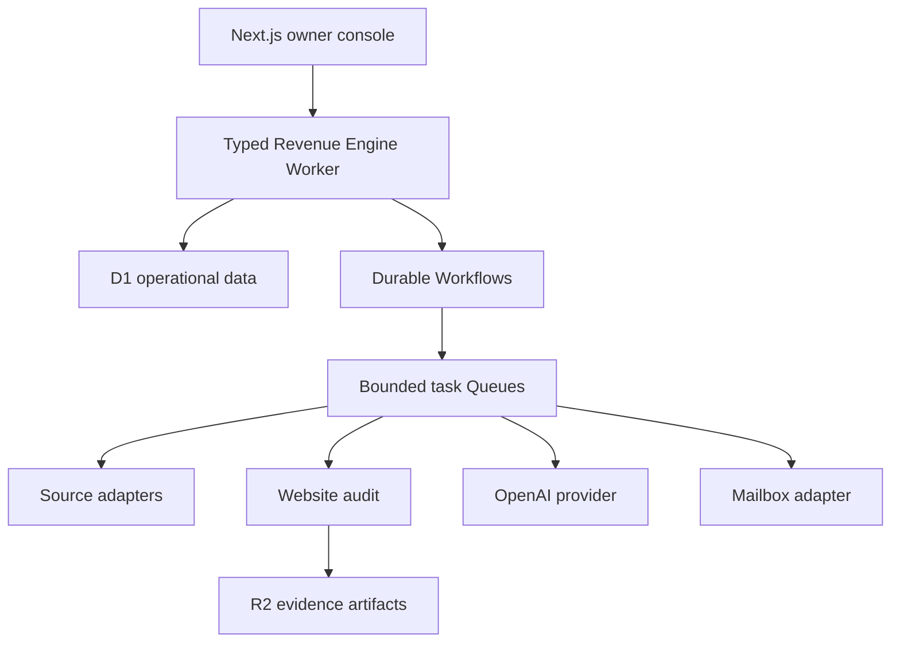

# Axiom Revenue Engine master plan

## Outcome

Build a private, evidence-first revenue system that continuously finds the best
local businesses to contact, proves why each needs help, selects the best
reachable channel, prepares specific outreach, and learns which leads become
opportunities and customers.

The north stars are qualified positive replies, opportunities, customers, and
revenue by acquisition cohort. Scraped rows and send counts are diagnostic only.

## Revenue loop

```mermaid
flowchart LR
  A["Plan uncovered market coverage"] --> B["Discover new businesses"]
  B --> C["Resolve canonical identity"]
  C --> D["Audit website and capture evidence"]
  D --> E["Score value, need, timing, and confidence"]
  E --> F["Find and verify reachable channels"]
  F --> G["Recommend the best next action"]
  G --> H["Owner approves specific outreach"]
  H --> I["Email or manual contact"]
  I --> J["Classify replies and opportunities"]
  J --> K["Run a versioned learning experiment"]
  K --> A
```

## Product contracts

### Coverage memory

Every source run stores source, niche, city, geographic cell, query, filters,
cursor, time, cost, result count, duplicates, and qualified yield. Discovery has
a 90-day cooldown; website audits have a 60-day cooldown unless change detection
triggers a refresh. Saturated cells stop automatically. A scheduled job must not
invent broader geography just to stay busy.

### Visible quality dimensions

Each dimension is scored 0–100 and remains visible:

| Dimension | Weight | Question |
|---|---:|---|
| Rebuild need | 35% | Is there a provable website/conversion weakness? |
| Business fit | 30% | Is this an independent, valuable business Axiom can help? |
| Reachability | 20% | Is a relevant legitimate channel available? |
| Timing | 10% | Is there a current reason to act? |
| Evidence confidence | 5% | How trustworthy and current is the proof? |

A priority lead requires total >=70, rebuild need >=65, business fit >=60,
evidence confidence >=80, a usable route, at least three supported observations
including a conversion-critical issue, and no suppression/legal/duplicate/chain
block. The UI never replaces these dimensions with one mysterious AI score.

### Website audit

Run deterministic checks before visual AI: availability, redirects, HTTPS,
broken pages/assets, desktop/mobile rendering, overflow/readability/tap targets,
navigation, offer/service-area clarity, above-fold CTA, tap-to-call, forms and
dead ends, service pages, trust signals, local proof, metadata/structured data,
and whether the site is already effective. Classify `REBUILD`,
`NO_SITE_NEW_BUILD`, `MINOR_IMPROVEMENT`, or `NO_OPPORTUNITY`.

Every claim retains URL, timestamp, screenshot/DOM proof, method, confidence, and
audit version.

### Reachability and outreach

**Owner requirement: no Google Workspace.** The Revenue Engine must not require
Workspace seats or Gmail as its target transport. Keep mailbox integration
provider-neutral and select a non-Google service only after verifying custom-domain
mailboxes, allowed outreach use, authentication, sending, replies, suppression and
total CAD cost within the existing ceiling. No replacement provider is selected
yet. Existing Gmail code and Gmail-specific tests describe legacy compatibility,
not the approved future email architecture.

Route in order: verified relevant named email; approved verified role email;
phone task; contact-form task; active social task; operator research. Only email
may be automated. Catch-all, generic, stale, malformed, suppressed, or unverified
email cannot autonomously send.

First-touch messages are plain text, about 60–110 words, and contain one supported
observation, why it matters to that business's customer, a relevant Axiom
capability, one low-pressure next step, identity, and unsubscribe. No tracking
pixel, fake urgency, fake familiarity, invented outcome, or generic template.
Variants stop at 25 first touches for review. Follow-ups remain disabled.

### Learning and commercial gates

The engine records owner corrections and reply outcomes by cohort, source,
weakness, contact type, variant, and sender. It proposes versioned experiments;
it never silently changes production policy.

Initial gates: >=85% agreement on a 50-lead owner-labelled set, >=1 qualified
positive reply per 100 verified first touches, bounce <2%, complaint <0.1%, and
unsubscribe plus negative <1%.

## Owner-first application

Navigation: Today, Leads, Outreach, Revenue, System. The lead dossier contains
identity, screenshots, plain-English “why,” critical/important/minor findings,
source proof, five scores, all routes, recommended action, draft/manual context,
and complete history. The main dashboard shows only metrics that change a
decision. Essential flows meet WCAG 2.2 AA and work on mobile and keyboard.

## Target architecture

- Console: Next.js/OpenNext on Cloudflare.
- Engine: separate typed Worker; Workflows for durable multi-step jobs and Queues
  for bounded fan-out.
- Data: new versioned D1 model with typed repositories; R2 for screenshots and
  immutable evidence.
- Auth: Cloudflare Access plus Better Auth.
- AI: OpenAI Responses, Structured Outputs, pinned GPT-5.4 nano/mini snapshots,
  deterministic checks first, per-job cost/token/retry caps, and evaluation before
  upgrades.
- Observability: structured logs, append-only funnel events, workflow receipts,
  cost ledger, real health checks, and actionable alerts.

Stable adapters: `SourceAdapter`, `AuditAdapter`, `ContactAdapter`,
`VerificationAdapter`, `AIProvider`, `MailboxAdapter`, and `WorkflowReceipt`.

## Safe migration

**Owner deployment hold (2026-09-08):** finish implementation and required local
acceptance work before proposing any deployment. No hosted preview, staging or
production publishing during the unfinished rebuild. Local prototypes, builds,
tests and no-upload dry runs remain allowed. Earlier staged-release sequencing
below is planning, not authorization. Follow the deployment boundary in
`docs/OWNER_CONTEXT.md` and the release gate in `docs/RUNBOOK.md`; Riley must
explicitly approve the exact release. Live operational and commercial pilot
results cannot be proven locally and must remain labelled outstanding, not
fabricated or silently removed from the completion criteria.

Keep legacy production paused and read-only. Back it up before schema/resource
work. Build v2 tables/resources beside legacy, import repeatably, reconcile every
count and suppression, run shadow mode, and cut over only after acceptance gates.
Keep the old Worker/export/rollback route for at least 30 stable days. Never
rename/delete the legacy database in place.

## Delivery phases

0. Privacy, safety, inventory, backups, mailbox recovery, and public-brand fix.
1. Durable repo context, naming, CI, characterization tests, staging foundation.
2. Canonical identity, coverage memory, source adapter, audits, evidence, scoring,
   and the 50-lead evaluation set.
3. All channel records, verification, consent evidence, provider-neutral reply sync, suppression,
   evidence-grounded generation, and approval queues.
4. Owner-first Today/Leads/Outreach/Revenue/System experience.
5. Shadow run and controlled KW pilot: max 50 first touches/week, starting at five
   per healthy mailbox per working day.
6. Limited first-touch autonomy only after two successful review periods; expand
   one niche/cohort at a time.

Each phase's detailed current gate and next work live in `docs/STATUS.md`.

## Budget

The [non-Google email review](EMAIL_PROVIDER_DECISION.md) dated 2026-09-08
supersedes any blanket claim that this ceiling already funds a verified complete
outreach stack. Cheap ordinary mail is not campaign permission. Mailforge is a
conditional research candidate, not selected; its minimum plus current non-mail
allowances exceeds C$50 before extras. The guide's C$85 scenario is unapproved,
not a checkout quote. Keep the existing ceiling and no-purchase/no-deploy gates;
do not remove required functionality or verification to make the estimate fit.

The runtime ceiling remains C$50/month. The prior C$18.40 Google Workspace
allocation is withdrawn; it is an unassigned email/provider reserve, not a
subscription commitment or verified quote. Other planning allowances remain
C$7 Cloudflare, C$7 OpenAI, C$5 source API, C$5 verification, C$2 domain renewal
and C$5.60 tax/exchange/incident buffer. Revalidate the full allocation after
choosing a non-Google provider. Alert at 70%, pause discretionary acquisition
at 85%, and hard-stop nonessential jobs at 100%.

## Complete means

All live resources use the Revenue Engine identity; legacy automation is not
required; data reconciles; selected leads have current reproducible evidence;
coverage is remembered; every route is represented; email is verified,
attributable, suppressible, and compliant; replies become CRM opportunities;
Riley operates the app in 30 minutes/week; the C$50 ceiling is enforced; docs
match production; and a new task resumes from the repository alone.
