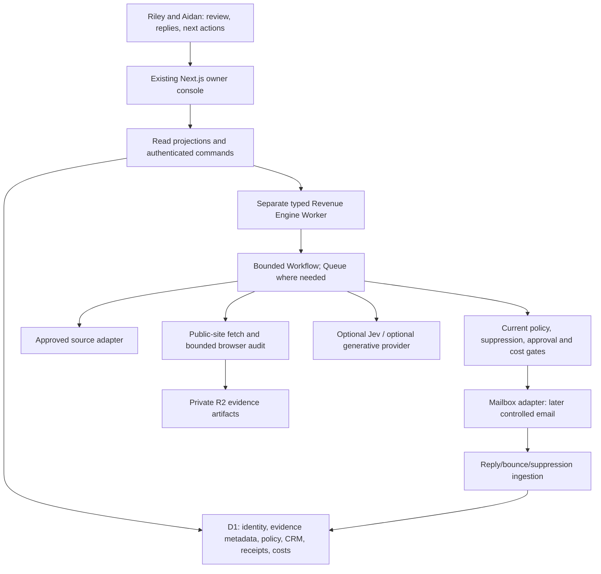

# Axiom Revenue Engine — master plan v2

**Revised:** 2026-09-20, America/Toronto. **Planning baseline:** `02e0c5a3ef69fe004d8ab7aab1314f0021f07f33`.

**Document authority:** this is the current product and architecture roadmap. The owner requested a comprehensive redesign and saved documentation, explicitly **no implementation in this work cycle**. New thresholds, providers, permissions, resource activations, migrations, offers, and autonomous behavior below are proposed versioned changes, not active policy. Existing code and approval boundaries continue to govern execution until separately changed and verified.

Read [STATUS](STATUS.md) for what is actually verified, [DELIVERY_PLAN](DELIVERY_PLAN.md) for milestones, [OPERATING_MODEL](OPERATING_MODEL.md) for owner workflows and contact rules, [PROVIDER_AND_BUDGET_PLAN](PROVIDER_AND_BUDGET_PLAN.md) for account dependencies, and [VALIDATION_PLAN](VALIDATION_PLAN.md) for acceptance. Historical plans and status are preserved in [the archive](archive/2026-09-20/MASTER_PLAN.md). This plan supersedes their future sequencing; it does not erase their evidence or silently revoke existing ADR safety decisions.

## 1. The decision

Build a small, evidence-backed **sales operating system for two founders**, using the existing Cloudflare and TypeScript investment. Deliver it through complete owner workflows, beginning with ten real, reviewed businesses and ending with a controlled opportunity-to-customer loop. Automate repetitive research after proving it produces worthwhile leads. Introduce Jev or generative AI only where a measured task benefits.

The first useful product is a short list of businesses Riley and Aidan can understand and act on: who they are, why a website project could help, what is actually proven, how they may be contacted, and the next action. The final product adds governed outreach, reply handling, CRM, and revenue feedback. A larger database or a more elaborate agent system is not an outcome.

**Critical changes from the former plan:**

- No OpenAI account or API key is assumed. Riley explicitly has none. Adapter source is reusable code, not a connected service.
- Jev is an optional experiment after a working evidence path, not the engine's organizing principle or a required first purchase.
- Local operator-assisted validation precedes unattended discovery and cloud activation. Real website capture is a separately scoped research operation, never inferred from fixture success.
- Existing provenance protections are reused. Stop expanding disconnected protection layers unless a concrete threat, failing acceptance test, or real workflow demands it.
- Prioritize accounts independently of contact readiness; a strong business without email remains valuable.
- Reply and suppression operations must work before production sending can work safely.
- Start with 5–10 total first touches per week as a proposed controlled experiment. The existing 50/week ceiling is not a target or authorization.
- Treat fixed bills, prepaid minimums, exchange, taxes, and owner time as first-class constraints. C$50 is a total ceiling, not a pool available to each provider.

## 2. Business outcome and boundaries

### Market and offer

Initial geography remains Kitchener, Waterloo, and Cambridge; initial niches remain roofing, HVAC, and landscaping. Target established independent local operators with an observable website problem and a plausible fit for Axiom's actual services. Do not equate review count, site age, or a missing booking widget with budget, buying intent, lost revenue, or need for a rebuild.

Axiom sells website design/rebuilds, hosting, and support. The internal Revenue Engine is not the public offer. [The current public pricing page](https://getaxiom.ca/pricing/) must govern any campaign price claim after an owner review; the former C$150–C$200 monthly/C$3,500 starting assumptions are not reliable current copy. Portfolio concepts remain labelled concepts. No invented client results, familiarity, urgency, customer logos, or guaranteed lead improvements.

Riley owns design, technical quality, and implementation; Aidan owns sales coordination and follow-through. Both retain authority over policy, offers, campaign approval, spend increases, and releases. Every active lead/opportunity has one accountable owner, one next action, and one due date.

### Success

Primary outcomes are owner-confirmed useful opportunities, customers, collected revenue, and contribution after acquisition/service costs. Leading indicators are worthwhile leads found, qualified positive replies, review minutes, and completed next actions. Every rate shows its numerator, denominator, window, and data completeness. No open-rate optimization or tracking pixel dependency.

Preserve the owner usability targets: find the next lead within 10 seconds, understand its rationale within 15 seconds, review a prepared message within 30 seconds, and stop new dispatch within 5 seconds. These are task-completion tests with the owner, not merely page-load benchmarks.

Thirty minutes/week is the target for routine system review. Initial calibration, sales calls, writing proposals, responding to genuine inquiries, and client delivery are additional work. The weekly shortlist shrinks when capacity is insufficient; the system never raises contact volume to satisfy a metric.

### Non-goals

No mailbox farm; paid ads; automated calls, forms, or social DMs; general-purpose autonomous browser agent; nationwide data collection; fully automatic proposals or pricing; custom foundation-model training; vector database before a demonstrated retrieval need; microservices beyond the existing console and engine separation; or a rewrite of the business website. The separate supervised AI-calling project stays outside this engine.

## 3. Reality before architecture

The source audit found two generations sharing the repository:

| Area | What exists in source | What must not be assumed |
|---|---|---|
| Legacy | Intake/scrape, lead records, Gmail/outreach, replies, CRM, exports | Currently safe/healthy/live just because source exists; historical leads are newly qualified |
| New domain | Evidence capture contracts, deterministic audit, qualification, assessment and contact persistence, extensive provenance tests | Real provider execution, current real-business evidence, deployed schemas |
| New console | Read-only Leads/dossier, Quality Lab, authenticated owner projections | End-to-end sales execution or current deployment of all screens |
| Engine Worker | Two-step validate-and-halt scaffold and typed adapter interfaces | A working source consumer, scheduler, queue, Browser/R2 pipeline, mailbox or AI connection |
| AI | OpenAI Responses adapter with pinned model IDs | Credentials, account funding, an available fallback, measured Axiom savings |
| Budget | Cost-related schemas/contracts and zero-cost fixture limits | Atomic cross-provider runtime reservations and a functioning global monthly stop |

The historical status records a paused legacy deployment and isolated staging. Those are dated records, not a fresh remote inspection. Use [the code reality audit](research/2026-09-20-revenue-engine-code-reality.md) and current validation results. All future operational inventories must record time and environment.

Every capability will show four independent facts: **built**, **connected**, **authorized**, **verified**. An API key existing would prove none of the latter three by itself. Account facts are non-secret metadata; secrets are never copied into documentation.

Absence of provider access still leaves a complete offline product: existing evidence fixtures/imports, deterministic audit and qualification, owner dossiers, editable message templates, a manual task list, and owner-recorded outcomes. Real email always requires a real lawful sender mailbox, even when sent manually; no provider-free plan can manufacture that capability.

## 4. Architecture options and selection

| Option | Advantages | Material disadvantages | Decision |
|---|---|---|---|
| Local research scripts + spreadsheets + manual mail | Fastest way to validate quality and sales workflow; no new cloud provider needed | Fragile multi-owner handoff; workstation availability; fragmented history | Use as a bounded bridge and evaluation path, not permanent unattended production |
| Existing console + modular Cloudflare engine, D1/R2, bounded Workflows/Queues | Reuses tests/UI/contracts; centralized records; low marginal infrastructure cost; durable execution | Integration, credential, privacy, and release work remain; provider budgets still need implementation | **Target architecture**, activated incrementally |
| Managed CRM/outbound suite or VPS rewrite | Some ready-made sales features or familiar server semantics | Added subscription/migration cost, weaker evidence fit, service maintenance or vendor lock-in | Reconsider only if real adoption/maintenance costs beat the current approach |

Do not interpret retention of the stack as a mandate to activate every Cloudflare product at once. The local slice uses existing disposable/ignored SQLite patterns. The first cloud slice needs only its actual bindings. Workflows handle resumable multi-step execution; one bounded Queue is added when durable fan-out, backpressure, or scheduling separation is genuinely needed. No cron self-fetch loops.

### Boundaries

- Keep domain policy pure and testable in `src/lib/revenue-engine/`. Provider adapters translate requests/results without making commercial or consent policy.
- Keep long-running orchestration in `src/engine/`. No new orchestration in the multi-thousand-line legacy scraper/outreach modules.
- Use D1 for authoritative operational records and R2 for private artifacts. Workflow state is execution history, not the only business record.
- The console reads bounded projections and issues authenticated, authorization-checked commands. A UI badge is never an enforcement gate. Existing SELECT-only readers are application constraints, not proof of database-level read-only credentials.
- Maintain one internal Axiom organization with two named operators. Design owner assignment and access checks now; defer multi-tenant SaaS features.
- Use native Fetch APIs and existing validation libraries. Add a dependency only when it eliminates more maintenance than it introduces. Check bundled Next.js documentation before any future code change.

## 5. The acquisition and sales loop

### 5.1 Coverage and discovery

Start with an owner-reviewed manifest of ten businesses using independently acquired public evidence. Codex can assist the authorized research; the owner should review identity and scope, not manually retype data. Then acquire at least 40 additional real dossiers under a bounded research extension and freeze exactly 50 eligible businesses for the existing quality gate. Reuse the initial ten only while current and compatible with cohort balance; replace ineligible records. Every evaluated case needs real evidence and a current assessment. Synthetic records validate software but never count as market research.

Source priority: known/referral businesses and owner-reviewed imports; direct business websites found through permitted research; licensed local/open datasets after checking terms and field usefulness; then a supported commercial source only after a measured coverage gap justifies it. A search-results page or directory row is a hint, not final identity, qualification, consent, or evidence of a missing website.

Record source identity, query, niche, country/region/city, geographic cell, cursor, retrieval time, licence/terms version, storage restrictions, units/cost, candidates, duplicates, and accepted useful yield. The default 90-day discovery cooldown and 60-day audit refresh from the old plan remain reference policies, subordinate to provider restrictions, material changes, and action-specific freshness. Saturated cells stop. A failed or exhausted source does not authorize broader geography or a different paid provider.

Each source adapter must emit field-level `allowedUses`, `retainUntil` or review date, attribution requirements, and whether derived fields may persist. Unknown rights block import of the affected fields. Independently obtained business-site evidence remains a different source record with its own rights; it is not a transformed copy of restricted directory data.

Google Places is not the durable lead database: field-mask-dependent fees, attribution, and content-storage restrictions require a separate adapter policy. Store independently sourced business facts under their own provenance. Do not launder restricted provider content into permanent derived fields. Public Nominatim is not a bulk discovery backend. See [source/contact research](research/2026-09-20-revenue-engine-sources-and-contact.md).

### 5.2 Identity and exclusions

Canonical business IDs are internal stable identities. Domain, normalized phone, address, source IDs, branches, and alternate names are evidence about identity, not interchangeable primary keys. Exact domain/source matches can nominate a match; shared switchboards, franchises, redirects, acquisitions, and multiple locations require conflict checks. Fuzzy matches are review candidates. Merges need an audit trail, reversible mapping, and suppression reconciliation.

Exclude wrong-market businesses, known closed businesses, lead-generation shells, unsupported service types, and chains according to the frozen target policy. Unknown independence is review, not invented certainty. Record rejection reasons and sample rejected cases for false-negative review. Keep suppression independent of identity updates so a new domain/contact import cannot resurrect a stopped account.

### 5.3 Progressive website audit

Spend effort in stages: identity/basic availability -> bounded HTML facts -> selected high-signal pages -> browser evidence for potentially worthwhile or uncertain sites -> optional AI interpretation. Never buy a deep audit of every scraped row.

A default proposed per-business capture budget is homepage plus up to three relevant same-site pages, at most desktop and mobile viewports, two concurrent businesses, and a bounded wall-clock/byte/browser-time limit configured before a run. The exact operational limits must be reconciled with existing source contracts and measured in the ten-business slice; this document does not override their current limits.

Check actual availability/redirects, HTTPS, broken assets/navigation, overflow, readable text, tap targets, phone/CTA usability, service-area/offer clarity, form affordances, service/trust pages, and metadata. Do not submit forms, log into a prospect site, solve CAPTCHAs, bypass access controls, or treat cookie blocks as defects. HTML cannot establish above-fold layout or computed mobile visibility. Field performance data and lab observations must be labelled separately; no invented Core Web Vitals or lost-sales estimates.

Distinguish `REBUILD`, `NO_SITE_NEW_BUILD`, `MINOR_IMPROVEMENT`, `NO_OPPORTUNITY`, and incomplete/failed audit state. No website found is not proof that no website exists. Retry a transient outage conservatively before using it in outreach. Missing pages or failed captures prohibit absence claims about those pages.

Every factual claim stores business, exact source/artifact, capture time, extraction method, audit version, uncertainty, and which observation supports it. Unsupported claims never enter a draft. Cosmetic taste alone does not justify a full rebuild.

### 5.4 Qualification and next action

Preserve five visible dimensions: rebuild need, business fit, reachability, timing, and evidence confidence. Existing `revenue-shadow-v3` weights (35/30/20/10/5) and thresholds remain unchanged in code. The current priority gates are total >=70, need >=65, fit >=60, evidence >=80, three supported observations including a conversion-critical issue, a usable route, and no policy block.

**Proposed policy experiment:** split the owner view into account opportunity and action readiness. Show strong-fit/high-need businesses awaiting contact research beside ready-to-contact businesses; do not make email the price of admission. Before changing ranking weights, label the fixed cohort and compare false positives/negatives. The suggested split can first be a read-only view; any score/policy change requires a versioned experiment and updated tests.

Timing must come from a dated observable event or owner knowledge, not a model's guess. Business value remains an evidence-backed fit judgement, not predicted revenue. Evidence confidence describes source coverage/reliability; Jev confidence is a separate model statistic.

Keep `accountOpportunity`, `actionReadiness`, and `decisionAdvisory` as separate proposed projection fields. An advisory cannot write the five scores, especially `evidenceConfidence`, change a qualification band, create source evidence, or advance a workflow gate. A future experiment to use AI in qualification requires a separately specified scoring policy and evaluation; displaying advisory triage is not that experiment.

### 5.5 Contact and consent

Discover contact candidates from the business's own current pages and other permitted sources. Separate candidate existence, identity/relevance, deliverability, lawful basis, suppression, and approved action. DNS/MX checks do not prove mailbox deliverability. A verifier's deliverable result does not create consent. Catch-all, unknown, stale, generic-unapproved, and disposable addresses remain blocked for autonomous email.

A public email can support implied consent only when its publication and the proposed message meet the actual CASL conditions; capture source, recipient role, relevance, and no-solicitation context. Bought lists and public appearance alone are insufficient. Consent basis has its own lifecycle and withdrawal; preserve minimum evidence required for accountability. Detailed contact and retention policy lives in [OPERATING_MODEL](OPERATING_MODEL.md).

Only verified email may eventually automate. Phone, form, and social are manual tasks under their own rules; manual does not mean exempt from consent, platform rules, calling restrictions, or suppression. No unattended AI calling integration.

### 5.6 Message preparation and approval

Use a versioned owner-approved offer and claim library. The first draft can be a deterministic, editable template populated with one verified observation, its practical customer consequence, a relevant Axiom capability, and a low-pressure next step. Human-written copy is a valid baseline. Jev cannot write it; optional generative drafting is not a dependency of the first pilot.

Keep the existing 60–110-word target as a guideline, with mandatory identity/contact/unsubscribe information preserved even if that makes a message longer. No fake personalization, fabricated urgency, tracking pixels, unverifiable uplift estimates, or unrequested attachments. Resolve identity/legal sender name and mailing address before real sending; brand name is not a substitute for the legal identification decision.

An approval binds exact recipient, mailbox, business, body/subject digest, source evidence versions, campaign/offer/variant, policy version, and expiry. Any material change invalidates it. Batch review may approve each visible exact message without requiring the owner to click through every internal persistence step. Current command-specific approval rules remain until a separately reviewed replacement exists.

### 5.7 Sending and replies

Sending is the last feature to activate. First prove inbox ingestion or a documented manual monitoring process, bounce handling, unsubscribe suppression, owner assignment, and stop controls using mail sinks. Begin with human-triggered exact-message sends after mailbox and legal readiness. No automatic follow-ups.

Before M4 completes, reconcile legacy suppressions, prior contacts/sends, replies and canonical identities in a read-only report, then perform any approved additive import. Every unresolved legacy mapping is blocked for new outreach. Preserving a stop takes precedence over retaining a convenient merge or contact candidate. A v2 record is not a fresh permission to approach someone already contacted or suppressed.

Recheck all applicable gates immediately before dispatch against authoritative current state, not a cached owner projection: global/campaign/mailbox stop, contact verification, lawful basis, suppression, exact approval, evidence freshness, contact cadence, owner capacity, and budgets. Check both recipient and business-level conflicts; avoid concurrent approaches from Riley and Aidan.

Treat provider acceptance, confirmed send, delivery evidence, bounce, human reply, qualified interest, and opportunity as different events. A successful API response is not proof the recipient saw a message. If a send times out after dispatch, record `UNKNOWN_OUTCOME`, stop retries, and reconcile against provider history or owner review. Application idempotency and a stable Message-ID do not create a Gmail exactly-once guarantee. See [Google send API](https://developers.google.com/workspace/gmail/api/reference/rest/v1/users.messages.send).

Reply priority is unsubscribe/complaint and bounces first, then genuine interest, questions/referrals, negative replies, out-of-office, and unrelated mail. Suppression takes effect immediately in application policy. Ambiguous stop requests pause further contact pending review. AI may suggest reply labels later; it cannot override a stop request or send an answer. Assign a backup owner and a response-due time. If replies are stale or unhandled, reduce or pause new outreach.

Proposed initial capacity gate: at most ten prepared first-touch tasks in queue inventory across both owners, no new tasks while an actionable reply is overdue by one business day, and no expansion when the measured routine review exceeds 30 minutes/week for two reviews. Queue inventory is separate from the proposed 5–10 total external first touches per week; these are not additive send allowances. Urgent stop/complaint handling is immediate when observed. Each mailbox has a named primary and backup; if neither can cover replies, new first touches pause. Reduce volume rather than hiding overdue work.

### 5.8 Opportunities, customers, and learning

Proposed CRM stages: `NEW_REPLY`, `QUALIFYING`, `MEETING`, `PROPOSAL`, `WON`, `LOST`, `DEFERRED`. Each transition records owner, source, timestamp, reason, next step, due date, and business/contact lineage. An interested reply is not a sale. Mark `WON` only on a recorded owner-confirmed commercial commitment, and track signed value, invoices, collected cash, refunds, recurring services, delivery/handoff, and cancellations separately.

Record original discovery source and the outreach campaign/variant that initiated the conversation; preserve later touches without inventing causal attribution. No accounting integration is required for the first loop: an owner-recorded amount with source/document reference is acceptable. Never request payment or issue invoices automatically as part of lead qualification.

Weekly learning asks: which source found worthwhile accounts, which claim/offer generated genuine conversations, where review time was wasted, and what happened after the reply? Change one significant variable per versioned experiment. Keep negative outcomes and suppression. Do not tune on the holdout and then present it as independent validation.

## 6. AI strategy: optional, task-specific, measurable

| Task | Default | Optional experiment | Admission test |
|---|---|---|---|
| URL checks, dates, arithmetic, duplicates, budget and send gates | Deterministic code | None | Exact tests and current data |
| Business/service fit and research triage | Rules + owner judgement | Jev Choice questions over bounded evidence | Improves owner time/useful-lead selection on frozen labels |
| Relevant-page/DOM candidate selection | Extracted links + deterministic rules | Jev over bounded current element IDs | Better evidence yield/time on held-out sites; independent executor/verifier; no form submission |
| Visual interpretation | Browser measurements + human review | A provisioned vision model | Adds supported findings without false claims |
| Drafting | Approved templates + owner edits | Provisioned generative model | Less edit time; all claims grounded; no invented facts |
| Reply labels | Conservative rules + owner | Jev or generative classifier | Excellent stop/negative recall; no autonomous reply authority |

Build no model orchestra. Use one provider for a proven task, one bounded request for shared-state questions, and a visible manual fallback. Cache by exact evidence/request digest, question/prompt version, provider route and pinned model. Expired evidence invalidates a cached answer. Do not repeatedly ask the same question until the model gives a desirable answer.

Jev is text-only, does not generate prose, and has documented numeric/date, context, adversarial-input and cross-question consistency limitations. Use `Choice` with explicit unknown states for the first trial; evaluate Noul/Score separately. Neither typed output nor a high confidence score establishes truth. [Jev models](https://docs.typesafe.ai/models), [limitations](https://docs.typesafe.ai/model-jaggedness/jev-1.13).

No OpenAI keys are available according to the owner. Existing OpenAI adapter code remains inactive/reusable. A ChatGPT/Codex subscription and connector access are not production API credentials or a supported unattended runtime bridge. Preserve the earlier Jev research as a subordinate experiment, but [this master plan and delivery sequence](DELIVERY_PLAN.md) now govern when to do it.

[The deeper Jev investigation](research/2026-09-20-jev-deep-research.md) verifies a Vercel Gateway route (`typesafe-ai/jev`, evaluation API) and a live free promotion advertised to end September 25, 2026. This offers a candidate synthetic access experiment without OpenAI keys or moving Cloudflare hosting. Account eligibility, actual inference and immutable model pinning remain unverified. Browser demos justify testing closed-set DOM decisions, not promoting Jev to autonomous browsing, visual auditing, consent authority or a replacement for the M3 quality gate. Vercel plan commitments and commercial-use eligibility must fit the shared budget before adoption.

## 7. Data, execution, and security contracts

### Durable records

Reuse current Business/Location/SourceRecord, website/evidence, assessment, contact, verification, consent, qualification, and receipt models. Extend only at the delivery milestone that uses a new record. Planned operational additions include provider capability status, policy/campaign snapshots, cost reservations/attempts, approval/outbox records, inbound events, suppression, opportunities, owner actions, and outcome events. The [data dictionary](DATA_DICTIONARY.md) distinguishes implemented records from proposed records.

Current projection is separate from immutable history. Corrections append a new version and invalidate dependent approvals/caches. Every record has canonical identity, environment, schema/policy version, provenance, and timestamps. Store provider response IDs when available; never interpret their absence as zero cost or failed execution.

### Retries and budgets

Assume at-least-once queue delivery and retryable workflow steps. Make local state transitions conditional and idempotent, insert completion receipts only after their actual writes, and use a transactional outbox when an external effect cannot be atomic with D1. Do not use SQLite `BEGIN IMMEDIATE` code blindly in Workers D1; use the supported D1 batch/conditional-write semantics and integration tests. All task retries have explicit attempt identities and cost reservations. [Cloudflare delivery guarantees](https://developers.cloudflare.com/queues/reference/delivery-guarantees/), [workflow rules](https://developers.cloudflare.com/workflows/build/rules-of-workflows/).

Keep private in-process trusted-object checks inside the boundary where they are valid. A WeakSet identity does not survive process restart or a Queue message. Durable resumption must reload and validate authoritative stored state; serializing an object is not permission to execute it.

A simple pilot ledger comes before any paid engine provider operation, including manually triggered one-off work: reserve upper-bound marginal cost, atomically check the shared envelope, settle reported usage, and hold ambiguous requests conservatively. Build this prerequisite in M2 if capture/storage can incur cost; use verified zero-cost paths until it passes. Free tiers still require validated accounts, usage evidence and overage controls. Use currency in integer micro-units or exact decimal representation, versioned rate cards and FX assumptions; never floats as the sole budget authority. Provider quotas, account spend limits, concurrency and page caps add independent protection. Platform base bills and already-running requests cannot be cancelled by an application hard stop.

### Safety and privacy

Threats include hostile site content, SSRF/private-network redirects, poisoned source/CSV imports, cross-business evidence, stale approval replay, duplicate sends, stolen OAuth tokens, owner-session misuse, and accidental public evidence access. Validate every navigation/redirect and address family; enforce safe public egress and payload/time bounds. Restrict crawl scope, block downloads/forms and credential entry, and treat DOM/AI text as untrusted data. CSV exports neutralize spreadsheet formula injection.

Use Cloudflare Access plus existing application sessions as designed, with explicit operator authorization and CSRF protections for future mutations. Store provider/OAuth credentials in approved secret stores, separate staging/production, redact logs and URLs, and keep evidence private behind authorization. Never expose raw provider errors, personal inbox contents, or secrets to client-side bundles.

Collect only necessary business/contact data. Define retention per source and purpose: short-lived rejected research, current prospect evidence, longer justified contact/consent history, minimal suppression, and legal holds. Existing artifact lifecycle/proof protections remain; no blanket retention deletion or new bucket lifecycle is activated by this plan. A provider's no-training policy does not imply zero retention. See [OPERATING_MODEL](OPERATING_MODEL.md).

### Reliability and observability

For each run expose phase, last successful progress, next allowed action, failure reason, provider attempts, freshness, and reserved/settled/ambiguous cost. Readiness distinguishes locked, misconfigured, degraded and ready; never label an intentionally inert Worker healthy for revenue work. Correlate business/run/attempt/message IDs while excluding private payloads from logs.

A global stop must deny new external work within five seconds; an in-flight request may already have reached a provider and must be reconciled. Suppression and reply ingestion should continue when discretionary acquisition stops, within a reserved operations budget. Alert the owner once per actionable incident with deduplication, not for every paused cron tick.

Back up before migration/release, preserve provider identifiers, rehearse restoration in isolation, and define RPO/RTO from a restore drill rather than invented uptime claims. Keep the previous release and legacy read-only/export path for at least 30 stable days after cutover. Reconcile suppression, sent/reply history, business mappings, opportunities and monetary records before allowing new sends.

## 8. Economics and capacity

The total ceiling remains C$50/month, excluding the existing ChatGPT/Codex subscription. It covers actual allocated engine costs, including mailboxes, platform, domain allocation, source/verification/AI, tax and FX. No account or paid commitment is presumed active. Two actual mailboxes remain the intended launch configuration; deferring a seat is an explicit owner decision, not an alias workaround.

Use [the provider/budget plan](PROVIDER_AND_BUDGET_PLAN.md) as the rate-card and readiness source. The old C$18.40 Workspace line implied annual commitment; flexible Canadian pricing and taxes can change the available balance. Prepaid verification minimums can exceed the entire monthly ceiling even when their amortized unit cost looks cheap. Free credits require a real account and terms check and are never assumed renewable forever.

Proposed monthly controls: alert at 70% (C$35), stop new discretionary acquisition at 85% (C$42.50), and deny new nonessential paid work at 100% (C$50) using committed + spent + reserved forecasts. Preserve a contingency and essential response/suppression capacity. If fixed commitments already consume the envelope, pause scope or seek an explicit budget change; never silently borrow next month's money.

At 200 illustrative classifications of 3,000 input tokens, Jev inference is only cents. The earlier nano comparison is hypothetical, not savings against current spend. Owner review, source rights, browser evidence, verification access, deliverability and sales follow-through dominate practical value. Measure cost per owner-confirmed useful lead and per qualified opportunity, including retry/fallback and an optional explicit value for founder time.

## 9. Delivery gates

| Milestone | Observable owner outcome | Exit evidence |
|---|---|---|
| M0 — Planning baseline and repair inventory | Accurate saved plan and capability map | This docs-only revision, source research, honest verification results; no execution |
| M1 — One complete offline dossier | One business flows from a valid fixture/import to the existing owner dossier and survives restart | Existing contracts composed, current assessment reload, no network, replay and failure tests |
| M2 — Ten real evidence dossiers | Owners can judge actual KW prospects with reproducible proof | Separately authorized bounded research/capture, source rights, secure evidence storage, ten exact scoped records, measured review time |
| M3 — Fifty labelled leads and frozen policy | Know whether the engine finds worthwhile prospects | Existing 50-case gate, class metrics, frozen holdout, rejection sampling, tested operator workflow |
| M4 — Ready-to-contact workbench and reply readiness | Exact messages/manual tasks with contact/consent proof and a named reply owner | Mailbox/provider capability gates, suppression, sink-tested replies, approval and stop controls; still no live send |
| M5 — Controlled first-touch pilot | A small number of approved real conversations with complete history | Owner authorizes exact cohort/campaign; proposed 5–10/week total; every send accountable; no follow-ups |
| M6 — Opportunity-to-customer loop | Replies have owners, next steps, outcomes and collected-value tracking | CRM state, overdue alerts, loss reasons, lineage and weekly review working |
| M7 — Selective automation | Proven repetitive steps run within policy/time/cost limits | Sustained evaluation, healthy operations, owner-approved versioned experiment and rollback |

No milestone substitutes its completion for the next one's authorization. Yet do not add one owner interruption for each internal database transaction: design a bounded reviewed operation whose internal steps remain independently safe and auditable. Existing fine-grained commands may be composed or redesigned only through a reviewed, tested change.

The original staging packet names an older exact build. This documentation commit does not refresh it, deploy it, or approve it. Decide separately whether publishing that older console is useful or whether to prepare a new packet after the first meaningful integrated milestone.

## 10. Acceptance, experiments, and stop rules

The existing fixed 50-case acceptance requires all labels/reasons and balanced city/niche coverage, with >=85% agreement (at least 43/50). Add class-level results so an always-Weak classifier cannot appear useful. Proposed 30 tuning / 20 holdout partition is fixed before prompt/policy tuning and stratified as feasible. The full set remains the existing operational gate; only the untouched holdout supports an out-of-sample claim. Once inspected for tuning, it is no longer a holdout.

Track false negatives among rejected/deferred leads, priority precision/recall, unknown coverage, reviewer disagreement, and owner minutes. Missing class denominators are N/A. Ten records prove plumbing and usability, not market performance. Fifty labels cannot establish rare-error reliability or probability calibration.

For outreach, retain historical guardrails as monitoring targets: bounce below 2%, complaint below 0.1%, and negative/unsubscribe below 1%. At tiny samples these percentages are unstable. Every complaint, suppression defect, wrong-recipient event or duplicate-send concern pauses the affected scope immediately. A bounce triggers review and removal; broader source/mailbox pauses follow the configured incident rule. Do not conclude a complaint rate is below 0.1% simply because none occurred in 50 sends. A target of one qualified positive reply per 100 first touches is a hypothesis to evaluate, not a revenue forecast or permission to send 100.

Promotion requires useful-lead quality, measured owner capacity, resolved critical incidents, current consent/verification/source evidence, ready replies, budget headroom, and explicit owner approval of the next bounded cohort. Two review periods alone do not establish statistical success. Follow-ups require their own proposal, evidence and approval and remain off.

## 11. Decisions deliberately left to the owner

The plan selects architecture and sequencing now. Before actions become real, obtain concrete review of: actual provider/account commitments and taxes; approved sender/legal identification and mailing address; mailbox ownership/recovery; source-data rights and exact research scope; ten-business manifest; each deployed release/migration; any production policy experiment; exact outreach campaign/cohort; and a budget increase if the measured setup cannot fit.

Each decision must arrive as a prepared, understandable packet with consequences, price, next action and rollback. Do not ask the owner to solve routine implementation choices or to authorize already-authorized reversible work again. The current request authorizes this comprehensive planning revision and its commit only.
